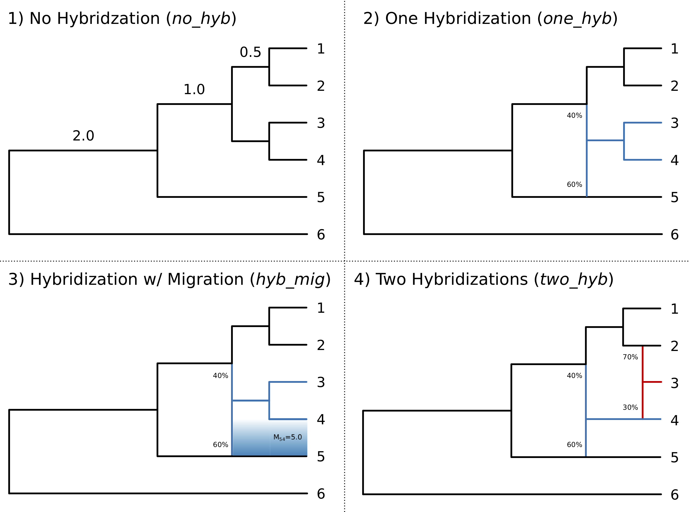

# Model Selection

The four models that we used two simulate data to train a convolutional neural network for classification.
The branch in the _no\_hyb_ model are in coalescent units, and each tree uses the same branch lengths.

----

### Notebooks

 - [`1_SimulateData.ipynb`]():
   In this notebook, we use the program [`ms`](http://home.uchicago.edu/~rhudson1/source/mksamples.html) [1]
   to simulate gene trees along a 50 Mb chromosome for each of the models depicted above.
 - [`2_PrepareData.ipynb`]():
   After the data are simulated, we convert each simulation into an "image" of taxon pairs arranged 
   in phylogenetic order on one axis (columns) and their coalescent times along the chromosome on the 
   other axis (rows). We also record which model was used to generate each image (labels).
 - [`3_TrainCNN.ipynb`](): 
   The images are split into training, validation, and test sets using 70%, 15%, and 15% of the data 
   for each category, respectively. We also layout the convolutional neural network (CNN) architecture 
   using a Keras classification model and train the CNN using the training and validation sets.
 - [`4_TestCNN.ipynb`]():
   With the model that we trained in the previous step, we take the test data set (which the CNN has 
   never seen) and run it through the model to predict which model generated the test image. We compare 
   this to the true generating model using the labels recorded for the test data to get a measure of 
   accuracy for the CNN.

**References**

[1] Hudson, RR. 2002. Generating Samples Under a Wright-Fisher Neutral Model.
*Bioinformatics* 18:337--338.
